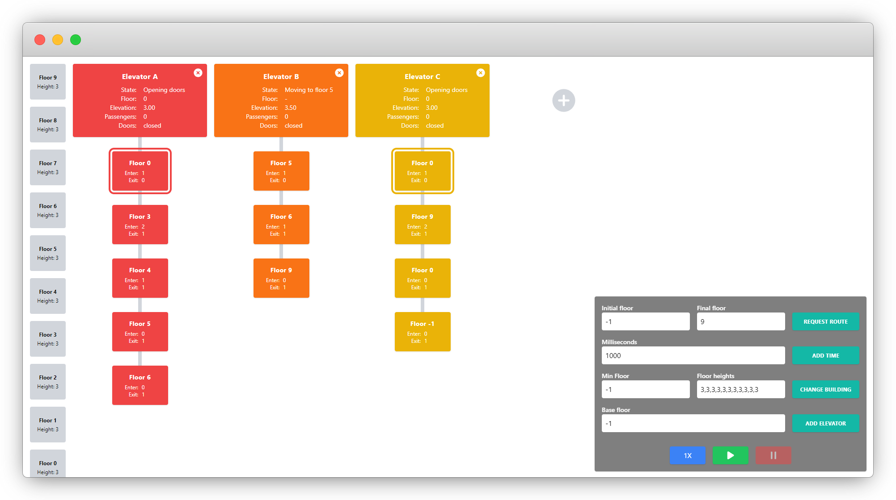
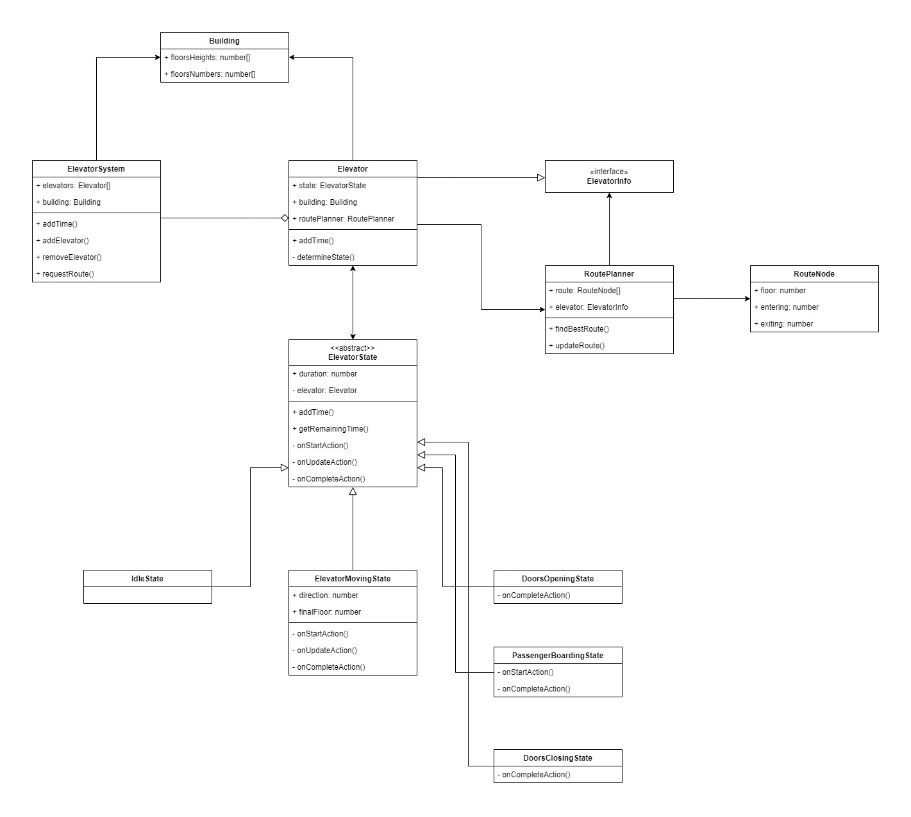
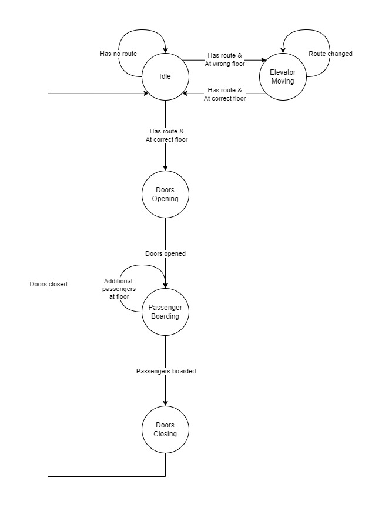
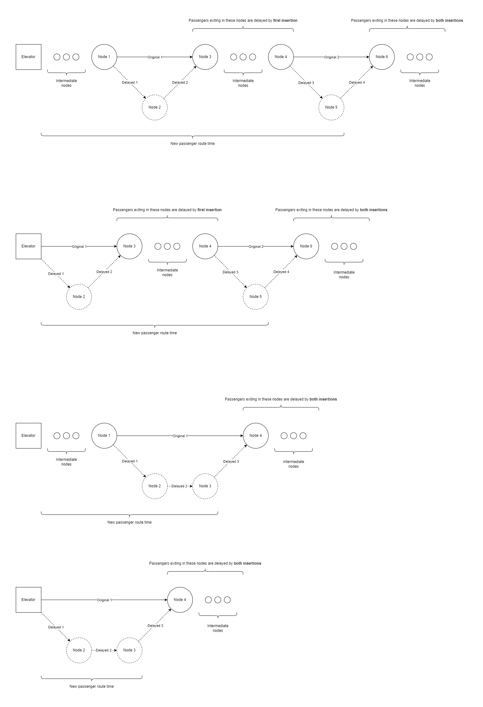

# ETD Elevator Simulator

## Preview

[Simulator can be previewed online here.](https://ushka1.github.io/etd-elevator-simulator/)

## Description

Time dependent elevator system simulator using the ETD (Estimated Time to Destination) algorithm with destination dispatch in full configuration.

### Useful links

- [Peters Research - ETD Algorithm with Destination Dispatch and Booster Options](https://peters-research.com/index.php/papers/etd-algorithm-with-destination-dispatch-and-booster-options/)
- [Elevation fandom - Destination dispatch](https://elevation.fandom.com/wiki/Destination_dispatch)
- [Elevation fandom - Destination dispatch - Full configuration](https://elevation.fandom.com/wiki/Destination_dispatch#Full_configuration)

## Setup

1. Run `npm install` to install the dependencies.
1. Run `npm run dev` to start the development server.

## Docs (WIP)

### Classes diagram

### Elevator state machine

### Route cost calculation

